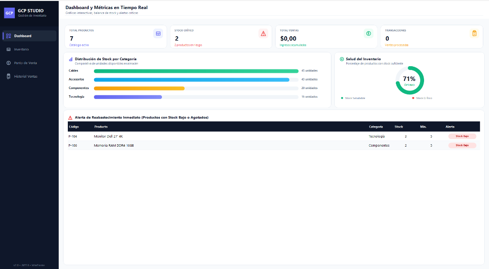

# GCP STUDIO - Sistema Inteligente de Gestión de Productos



GCP Studio es una aplicación moderna de escritorio desarrollada en **C# (.NET 8)** y **Windows Forms (WinForms)**. Está diseñada para ofrecer una experiencia de usuario (UX) ágil, elegante y eficiente para la administración de inventario, punto de venta y analíticas en tiempo real.

## Características Principales

*   **📊 Dashboard Interactivo:** Visualización de métricas en tiempo real, alertas críticas y distribución de stock mediante componentes personalizados (gráficas de dona y barras dibujadas nativamente).
*   **📦 Gestión Integral de Inventario:** Catálogo de productos completo con ficha detallada, edición ágil, control de precios y alertas de stock mínimo.
*   **🛒 Punto de Venta (POS Inteligente):** Facturación rápida con autocompletado, control de cantidad, resumen de cobro dinámico y descuento automático del inventario.
*   **📋 Historial de Transacciones:** Registro completo de todas las ventas procesadas.
*   **🎨 Diseño Moderno y Nativo:** Interfaz construida desde cero sin dependencias externas pesadas, utilizando custom painting (GDI+) para bordes redondeados, íconos vectoriales dinámicos y micro-animaciones a 60FPS.
*   **💾 Almacenamiento Local (JSON):** Persistencia de datos ligera y sin complicaciones mediante archivos JSON (productos y ventas).

## Requisitos del Sistema

*   [SDK de .NET 8.0](https://dotnet.microsoft.com/download/dotnet/8.0) o superior.
*   Sistema Operativo Windows (para soporte WinForms).

## Instalación y Ejecución

1. Clona el repositorio:
   ```bash
   git clone <URL_DEL_REPOSITORIO>
   ```
2. Navega al directorio del proyecto:
   ```bash
   cd GCP-GESTION-DE-PRODUCTOS-
   ```
3. Ejecuta la aplicación usando el CLI de .NET:
   ```bash
   dotnet run
   ```
*(La primera vez que se ejecute, el sistema creará automáticamente datos de prueba en los archivos `.json`)*

## Notas Técnicas sobre la UI

Esta aplicación demuestra técnicas avanzadas de personalización de UI en WinForms:
*   **DPI Unaware:** Configurado para prevenir el quiebre de componentes dinámicos en pantallas con alta resolución.
*   **Optimized Double Buffering:** Manejo avanzado del parpadeo (flickering) típico de WinForms y control de `Graphics` buffers residuales para garantizar transiciones fluidas.
*   **Anchor Layout Dinámico:** Cálculos manuales y tamaños dinámicos para garantizar adaptabilidad perfecta en pantallas de cualquier tamaño.

## Licencia
Distribuido bajo la licencia MIT.