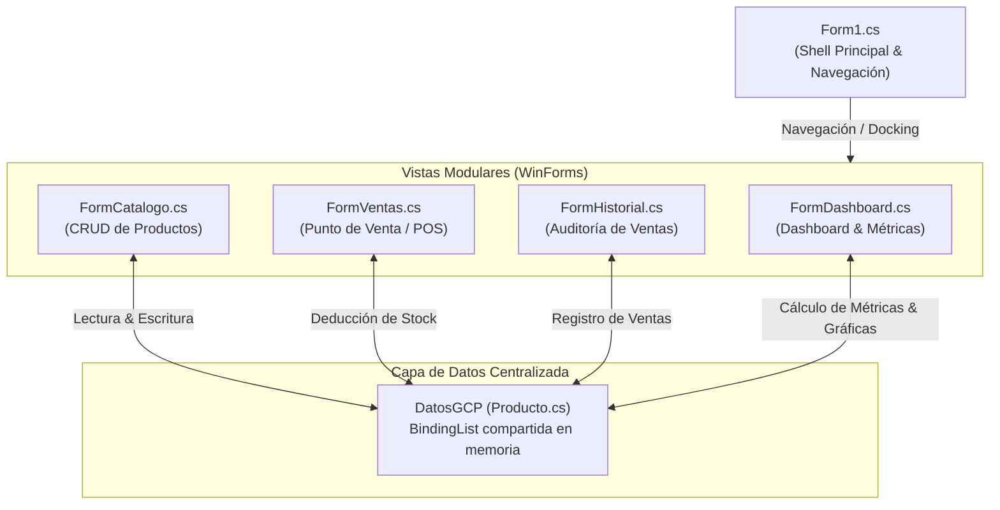

# 📦 GCP - Gestión y Control de Productos

[](https://dotnet.microsoft.com/)
[](https://learn.microsoft.com/dotnet/csharp/)
[](https://learn.microsoft.com/dotnet/desktop/winforms/)
[](https://visualstudio.microsoft.com/)
[](LICENSE)

**GCP (Gestión y Control de Productos)** es una aplicación de escritorio moderna, intuitiva y de alto rendimiento desarrollada en **C# y Windows Forms (.NET 10.0)**. Incorpora estándares visuales de software SaaS moderno, navegación fluida con micro-animaciones, analíticas gráficas duales dibujadas nativamente en GDI+ y arquitectura multi-formulario 100% editable en el Diseñador Visual de Visual Studio 2022.

---

## 🌟 Características Principales

### 📊 1. Dashboard Analítico Ejecutivo
* **Gráfica Dual de Alto Impacto (63% / 37%)**:
  * **📊 Gráfica de Barras de Stock**:
    * Columnas verticales con gradientes dinámicos (Índigo `#4F46E5` para stock saludable, Rosa/Rojo `#F43F5E` para stock crítico).
    * Esquinas superiores redondeadas y badges flotantes con valor numérico exacto (`u.`).
    * Guías horizontales de cuadrícula con escala en el eje Y.
    * **Línea de Umbral de Seguridad**: Marcador discontinuo en rojo destacando el límite de alerta (`⚠️ Límite Alerta 5 u.`).
  * **🍩 Gráfica Donut (Anillo Circular)**:
    * Segmentación porcentual de la salud del catálogo: `🟢 Stock Óptimo (>15 u.)`, `🟣 Stock Medio (6-15 u.)` y `🔴 Stock Crítico (≤5 u.)`.
    * Núcleo central con conteo total de artículos en vivo.
    * Leyenda interactiva inferior con tarjetas estilizadas y porcentaje calculado automáticamente.
* **Tarjetas de Métricas KPI**:
  * 💰 **Ingresos de Hoy**: Monto total acumulado en caja durante la jornada actual.
  * ⚡ **Ventas Concretadas**: Contador en vivo de tickets emitidos hoy.
  * 📦 **Artículos Activos**: Catálogo total de productos en inventario.
  * ⚠️ **Stock Crítico**: Alertas prioritarias de productos con 5 o menos unidades.

---

### 📦 2. Catálogo de Productos y Control de Existencias (`FormCatalogo.cs`)
* Registro, edición y eliminación ágil de productos con validaciones de campos y precios.
* Tabla `DataGridView` con cabeceras modernas en color Slate-900, selección de fila completa y visualización del total valorizado por producto.
* Botonera con retroalimentación visual (`Guardar`, `Modificar`, `Eliminar`, `Limpiar`).

---

### ⚡ 3. Punto de Venta / Caja Registradora (`FormVentas.cs`)
* Búsqueda y selección interactiva de artículos vía `ComboBox`.
* Indicador dinámico del stock disponible que previene la sobreventa.
* Control numérico de unidades (`NumericUpDown`) sincronizado con el inventario.
* Carrito de compras con cálculo automático de subtotales por artículo y cobro total destacado.
* Finalización de compra con deducción inmediata del stock en almacén y registro histórico.

---

### 🧾 4. Historial de Transacciones (`FormHistorial.cs`)
* Auditoría completa de ventas procesadas con marca temporal (fecha y hora), cantidad de unidades despachadas e importe total recaudado.

---

## 🎨 Diseño y Experiencia de Usuario (UI/UX)

* **100% Nativo en Windows Forms**: Construido íntegramente con componentes de `System.Windows.Forms` y `System.Drawing.Drawing2D`, sin librerías externas de terceros que sobrecarguen el binario.
* **Paleta de Colores SaaS Contemporánea**:
  * Fondo General: Slate-50 (`#F8FAFC`)
  * Barra Lateral de Navegación: Slate-900 (`#0F172A`)
  * Tarjetas y Contenedores: Blanco puro (`#FFFFFF`) con bordes sutiles Slate-200 (`#E2E8F0`)
  * Color Primario / Acentos: Índigo (`#4F46E5`)
  * Éxito / Estado Óptimo: Esmeralda (`#10B981`)
  * Alertas / Stock Crítico: Rosa/Rojo (`#EF4444`)
* **Navegación Fluida con Micro-Animaciones**: Indicador lateral deslizante accionado por temporizadores (`Timer`) que acompaña al usuario entre secciones.
* **Cero Parpadeo (Anti-Flicker)**: Implementación de doble búfer (`DoubleBuffered`) por reflexión en lienzos de dibujo GDI+ para tasas de refresco fluidas a 60 FPS.
* **Soporte Visual Studio Designer**: Todo formulario, panel, botón y tabla es `public` y respeta el ciclo de vida del diseñador, renderizando las métricas y gráficas incluso en modo diseño (`DesignMode`).

---

## 🏛️ Arquitectura del Software



### 📁 Estructura del Repositorio

```text
├── WinFormsApp1.slnx                     # Archivo de Solución de Visual Studio
├── README.md                             # Documentación del proyecto
├── .gitignore                            # Exclusiones de Git (bin, obj, .vs, etc.)
└── WinFormsApp1/                         # Proyecto Principal de Windows Forms
    ├── WinFormsApp1.csproj               # Configuración del proyecto (.NET 10.0-windows)
    ├── Program.cs                        # Punto de entrada de la aplicación
    ├── Producto.cs                       # Modelos de Datos (Producto, Venta, ItemCarrito, DatosGCP)
    ├── Form1.cs                          # Shell de navegación y orquestación
    ├── Form1.Designer.cs                 # Definición visual del Shell y Dashboard integrado
    ├── FormDashboard.cs                  # Formulario independiente de analíticas
    ├── FormDashboard.Designer.cs         # Diseño visual del Dashboard (Barras + Donut)
    ├── FormCatalogo.cs                   # Lógica del catálogo y administración de inventario
    ├── FormCatalogo.Designer.cs          # Diseño visual del Catálogo
    ├── FormVentas.cs                     # Lógica de caja y facturación POS
    ├── FormVentas.Designer.cs            # Diseño visual del Punto de Venta
    ├── FormHistorial.cs                  # Lógica del historial de compras
    └── FormHistorial.Designer.cs         # Diseño visual del Historial
```

---

## 💻 Requisitos del Sistema

* **Sistema Operativo**: Windows 10 (versión 1903 o posterior) o Windows 11.
* **Entorno de Ejecución**: [.NET 10.0 SDK](https://dotnet.microsoft.com/download) (o .NET 8.0 SDK).
* **IDE Recomendado**: Visual Studio 2022 (versión 17.8 o posterior) con la carga de trabajo *Desarrollo de escritorio de .NET*.

---

## 🚀 Instalación y Ejecución

### Opción 1: Mediante CLI de .NET

1. Clona el repositorio:
   ```bash
   git clone https://github.com/Jhonmoreno000/GCP-GESTION-DE-PRODUCTOS-.git
   cd GCP-GESTION-DE-PRODUCTOS-
   ```

2. Compila el proyecto:
   ```bash
   dotnet build
   ```

3. Ejecuta la aplicación:
   ```bash
   dotnet run --project WinFormsApp1
   ```

### Opción 2: Mediante Visual Studio 2022

1. Abre el archivo de solución `WinFormsApp1.slnx` en Visual Studio 2022.
2. Presiona `Ctrl + Shift + B` para compilar la solución.
3. Presiona `F5` o haz clic en el botón verde **Iniciar (WinFormsApp1)** para depurar y ejecutar.
4. Para editar visualmente cualquier pantalla, haz doble clic sobre cualquiera de los archivos `Form1.cs`, `FormCatalogo.cs`, `FormVentas.cs`, `FormHistorial.cs` o `FormDashboard.cs` para abrir el diseñador gráfico interactivo.

---

## 📄 Licencia

Este proyecto está bajo la Licencia [MIT](LICENSE) - puedes utilizarlo, modificarlo y distribuirlo libremente.