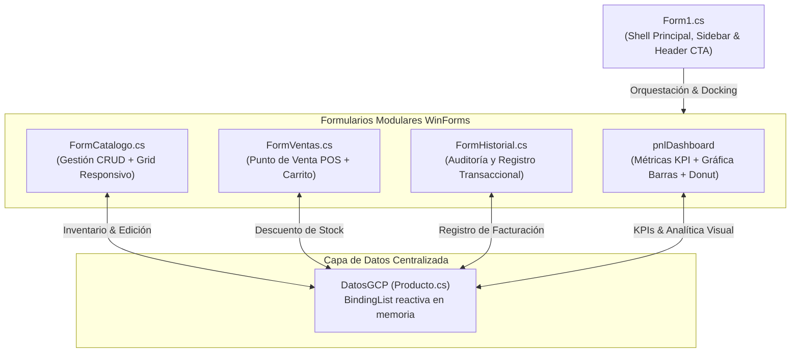

# 📦 GCP - Gestión y Control de Productos

[](https://dotnet.microsoft.com/)
[](https://learn.microsoft.com/dotnet/csharp/)
[](https://learn.microsoft.com/dotnet/desktop/winforms/)
[](https://visualstudio.microsoft.com/)
[](https://tailwindcss.com/)
[](LICENSE)

**GCP (Gestión y Control de Productos)** es un sistema de escritorio integral de **Punto de Venta (POS) y Administración de Inventarios**, desarrollado con **C# y Windows Forms (.NET 10.0)**. 

Combina la solidez y velocidad del runtime nativo de Windows con estándares contemporáneos de diseño SaaS: paleta de colores moderna, analíticas visuales duales en GDI+ a 60 FPS, navegación fluida con micro-animaciones, arquitectura táctil y **responsividad total en cada botón y contenedor**, garantizando compatibilidad nativa con el **Diseñador Visual de Visual Studio 2022**.

---

## 🌟 Módulos y Características

### 📊 1. Dashboard Ejecutivo & Analíticas Duales
* **Gráfica de Barras de Stock**:
  * Renderizado vectorial GDI+ con columnas verticales y gradientes dinámicos (Índigo `#4F46E5` para stock suficiente, Rosa/Rojo `#F43F5E` para stock bajo).
  * Esquinas superiores redondeadas y etiquetas flotantes de cantidad numérica (`u.`).
  * Cuadrícula con escalas numéricas y **línea horizontal de advertencia** (`⚠️ Límite Alerta 5 u.`).
* **Gráfica Donut (Anillo Circular)**:
  * Segmentación proporcional del estado del inventario: `🟢 Stock Óptimo (>15)`, `🟣 Stock Medio (6-15)` y `🔴 Stock Crítico (≤5)`.
  * Núcleo interactivo con conteo centralizado y leyenda porcentual inferior con tarjetas de colores.
* **Tarjetas KPI en Tiempo Real**:
  * 💰 **Ingresos de Hoy**: Total acumulado en ventas procesadas durante el día.
  * ⚡ **Ventas Concretadas**: Contador de recibos/facturas emitidas en vivo.
  * 📦 **Artículos Activos**: Catálogo total de referencias registradas.
  * ⚠️ **Stock Crítico**: Alerta de productos que requieren reposición urgente.

---

### 📦 2. Catálogo de Productos (`FormCatalogo.cs`)
* **Distribución Responsiva Proporcional**: Contenedor maestro `TableLayoutPanel` (35% Formulario de Entrada / 65% Tabla de Catálogo).
* **Botonera Táctil en Matriz 2x2**: Dispuesta en `TableLayoutPanel` al 50%/50% con `Dock = Fill` y altura ergonómica de 44px:
  * `➕ Guardar` (Verde Esmeralda `#10B981` | Hover `#059669`)
  * `✏️ Editar` (Índigo `#4F46E5` | Hover `#4338CA`)
  * `🗑️ Eliminar` (Carmín/Rojo `#EF4444` | Hover `#DC2626`)
  * `🧹 Limpiar` (Pizarra `#64748B` | Hover `#475569`)
* **Botón de Cabecera Dinámico**: `btnProdRefrescar` ("🔄 Actualizar Tabla") con `Anchor = Top | Right`.
* **Entradas Auto-Escalables**: Cajas de texto con anclaje horizontal (`Anchor = Top | Left | Right`).

---

### ⚡ 3. Punto de Venta / Caja Registradora (`FormVentas.cs`)
* **Distribución Responsiva**: `TableLayoutPanel` (38% Módulo de Cobro / 62% Canasta de Compras).
* **Control de Stock y Prevención de Sobreventa**: Menú desplegable interactivo sincronizado con el inventario en almacén; impide añadir cantidades superiores a las existencias reales.
* **Fila de Adición Fluida**: Grid responsive con caja numérica y botón `➕ Añadir` (38px de altura, `Dock = Fill`).
* **Botón de Cobro de Alto Impacto**: `btnVentaCobrar` ("💳 Procesar Cobro") con 54px de altura, ancho total al 100% de la tarjeta, feedback visual al presionar y deducción automática del stock.
* **Controles Rápidos de Canasta**:
  * `🗑️ Quitar Item` (`Anchor = Top | Right`)
  * `🔄 Vaciar Canasta` (`Anchor = Top | Right`)

---

### 🧾 4. Registro Histórico de Ventas (`FormHistorial.cs`)
* Auditoría completa y transparente de transacciones: Número de ticket, marca temporal (`Fecha y Hora`), volumen de artículos despachados y monto total facturado.
* **Botones de Control Superior**:
  * `🔄 Actualizar` (`btnHistorialRefrescar`)
  * `🗑️ Vaciar Historial` (`btnHistorialLimpiar`) con modal de confirmación de seguridad.
  * Anclados a la derecha (`Anchor = Top | Right`), conservando alineación perfecta sin importar la resolución.

---

### 🚀 5. Shell Principal y Navegación (`Form1.cs`)
* **Barra Lateral SaaS**: Fondo Slate-900 (`#0F172A`) con botones de navegación de 54px de altura, estados hover interactivos y cursor táctil.
* **Indicador Deslizante Suave**: Puntero animado en tiempo real a 60 FPS controlado por `Timer`.
* **Botón CTA de Cabecera**: `btnHeaderNuevaVenta` ("⚡ Nueva Venta") anclado a la derecha en la barra superior junto al estado del sistema, permitiendo abrir el terminal de venta desde cualquier módulo.

---

## 🎨 Arquitectura de Diseño Responsivo y Compatibilidad

```
┌────────────────────────────────────────────────────────────────────────┐
│  Form1: Header Superior Blanco con Anclaje Derecho [⚡ Nueva Venta]    │
├───────────────┬────────────────────────────────────────────────────────┤
│  Sidebar      │  Área de Trabajo Dinámica (Dock = Fill)                │
│  (Slate-900)  ├────────────────────────────────────────────────────────┤
│               │  TableLayoutPanel Responsivo (Columnas en %)           │
│  - Dashboard  │  ┌───────────────────────┬───────────────────────────┐ │
│  - Catálogo   │  │ Panel Entradas (35%)  │ Panel Tabla Grid (65%)    │ │
│  - TPV Venta  │  │ Botonera en Grid 2x2  │ Botones Anclados Derecha  │ │
│  - Historial  │  │ [Guardar]   [Editar]  │ [🔄 Actualizar Tabla]     │ │
│               │  │ [Eliminar]  [Limpiar] │ DataGridView Full Height  │ │
│               │  └───────────────────────┴───────────────────────────┘ │
└───────────────┴────────────────────────────────────────────────────────┘
```

### Reglas de Diseño Implementadas:
1. **Sin posiciones fijas rígidas**: Los botones de acción se agrupan en `TableLayoutPanel` proporcionales o utilizan `Anchor = Top | Right`.
2. **Dimensiones táctiles optimizadas**: Botones con alturas de 38px a 54px para máxima ergonomía visual.
3. **100% Compatible con Visual Studio 2022 Designer**:
   - Todos los controles y contenedores son de ámbito `public`.
   - Se instancian y configuran dentro de `InitializeComponent()` con secuencias limpias de `SuspendLayout()` / `ResumeLayout()`.
   - Ningún componente depende de llamadas externas que puedan fallar en tiempo de diseño (`DesignMode`).

---

## 🏛️ Diagrama de Componentes


```mermaid
flowchart TD
    Shell["Form1.cs\n(Shell Principal, Sidebar & Header CTA)"]
    
    subgraph Vistas ["Formularios Modulares WinForms"]
        Dash["pnlDashboard\n(Métricas KPI + Gráfica Barras + Donut)"]
        Cat["FormCatalogo.cs\n(Gestión CRUD + Grid Responsivo)"]
        Ventas["FormVentas.cs\n(Punto de Venta POS + Carrito)"]
        Hist["FormHistorial.cs\n(Auditoría y Registro Transaccional)"]
    end
    
    subgraph DataLayer ["Capa de Datos Centralizada"]
        Datos["DatosGCP (Producto.cs)\nBindingList reactiva en memoria"]
    end
    
    Shell -->|Orquestación & Docking| Vistas
    Cat <-->|Inventario & Edición| Datos
    Ventas <-->|Descuento de Stock| Datos
    Hist <-->|Registro de Facturación| Datos
    Dash <-->|KPIs & Analítica Visual| Datos
```

---

## 📁 Estructura del Código

```text
├── WinFormsApp1.slnx                     # Solución de Visual Studio 2022
├── README.md                             # Documentación oficial del proyecto
├── .gitignore                            # Reglas de exclusión para Git (.NET/VS)
└── WinFormsApp1/                         # Proyecto Principal
    ├── WinFormsApp1.csproj               # Manifiesto C# (.NET 10.0-windows)
    ├── Program.cs                        # Punto de entrada
    ├── Producto.cs                       # Entidades y Almacén en Memoria (DatosGCP)
    ├── Form1.cs                          # Lógica de navegación y Dashboard
    ├── Form1.Designer.cs                 # Interfaz del Shell y Gráficas GDI+
    ├── FormCatalogo.cs                   # Lógica de productos y catálogo
    ├── FormCatalogo.Designer.cs          # Interfaz responsiva del Catálogo
    ├── FormVentas.cs                     # Lógica de ventas y checkout
    ├── FormVentas.Designer.cs            # Interfaz responsiva del Punto de Venta
    ├── FormHistorial.cs                  # Lógica del registro histórico
    └── FormHistorial.Designer.cs         # Interfaz responsiva del Historial
```

---

## 💻 Requisitos del Entorno

* **Sistema Operativo**: Windows 10 (1903+) o Windows 11.
* **SDK de .NET**: [.NET 10.0 SDK](https://dotnet.microsoft.com/download) (compatible con .NET 8.0).
* **Entorno Recomendado**: Visual Studio 2022 (v17.8 o superior) con la carga de trabajo *.NET Desktop Development*.

---

## 🚀 Compilación y Ejecución

### Opción 1: Desde la Terminal (CLI)
```bash
# 1. Clonar el repositorio
git clone https://github.com/Jhonmoreno000/GCP-GESTION-DE-PRODUCTOS-.git
cd GCP-GESTION-DE-PRODUCTOS-

# 2. Compilar
dotnet build

# 3. Iniciar la aplicación
dotnet run --project WinFormsApp1
```

### Opción 2: Desde Visual Studio 2022
1. Abre `WinFormsApp1.slnx`.
2. Presiona `Ctrl + Shift + B` para compilar.
3. Presiona `F5` para depurar y ejecutar.
4. Para diseñar visualmente, haz doble clic sobre cualquier archivo `Form*.cs` para acceder al Diseñador Gráfico.

---

## 📄 Licencia

Este proyecto está bajo la Licencia [MIT](LICENSE) - libre para uso académico, comercial o de desarrollo.